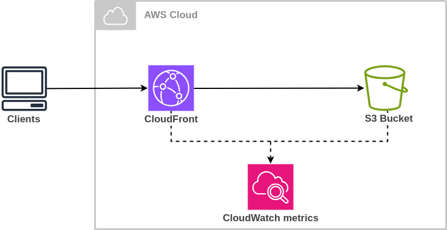
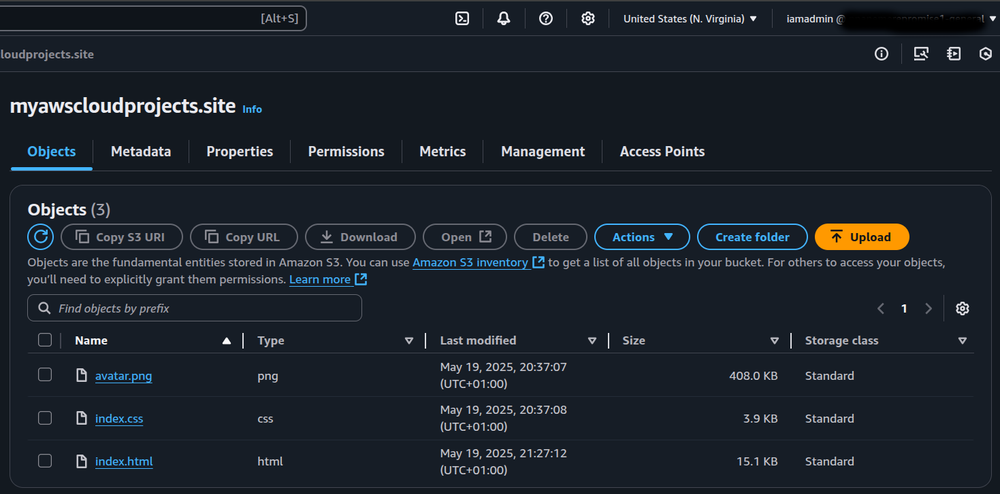
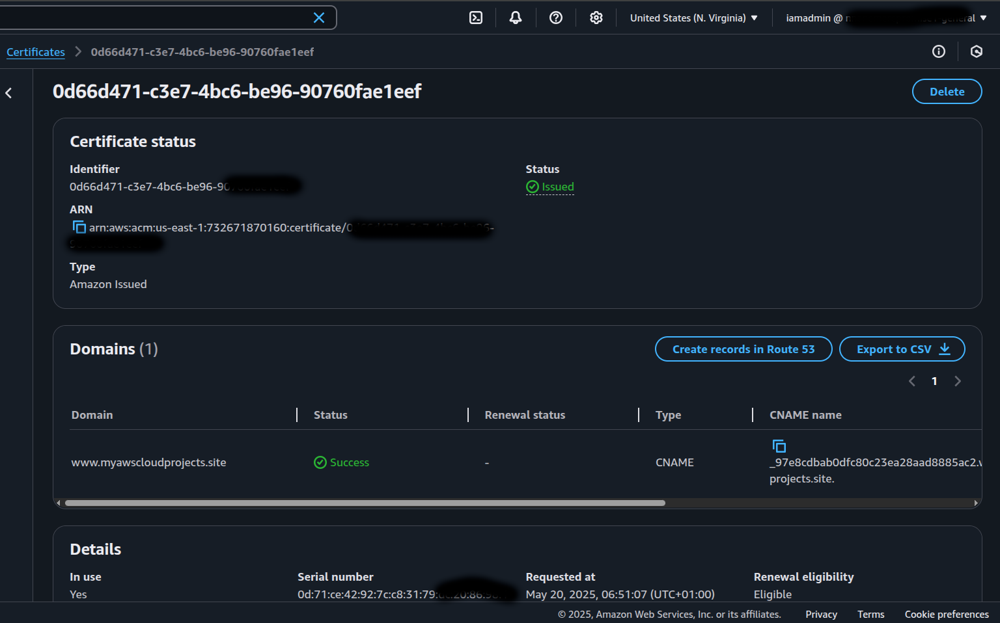

# 🌐 AWS Portfolio Website

This is my personal portfolio website, built with HTML and CSS and hosted on **Amazon S3** with a custom domain managed via **Namecheap**. The project demonstrates how to host a secure, globally distributed static site using **AWS CloudFront** and **ACM (SSL)**.

---

## 📌 Project Overview

| Feature | Description |
|--------|-------------|
| **Hosting** | Amazon S3 (Static Website Hosting) |
| **CDN & HTTPS** | Amazon CloudFront with SSL (ACM) |
| **Custom Domain** | [myawscloudprojects.site](https://myawscloudprojects.site) via Namecheap |
| **Deployment** | Manual (ClickOps via AWS Console) |
| **Tech Stack** | HTML, CSS |

---

## 🛠️ Implementation Details

### 1. ✅ Amazon S3 Bucket
- Created S3 bucket named `myawscloudprojects.site`
- Enabled static website hosting
- Uploaded `index.html` and `index.css`
- Configured index document and error document

### 2. 🔒 Permissions & Security
- Disabled public access block
- Added custom bucket policy to allow CloudFront access
- Used CloudFront **Origin Access Control (OAC)** instead of public access

### 3. 🌍 Domain Routing with Namecheap
- Set up **Custom DNS**
- Added AWS name servers to Namecheap dashboard
- Managed DNS routing via Route 53 hosted zone

### 4. 🌐 CloudFront Distribution
- Pointed to the S3 origin using OAC
- Enabled HTTPS using AWS Certificate Manager (ACM)
- Set `index.html` as the default root object

---

## 📂 Project Architecture

---

## 📸 AWS S3 Bucket

> 

---

## 📸 CloudFront Distribution

> 

---

## 🚀 Live Demo

🔗 [Visit My Portfolio](https://myawscloudprojects.site)

---

## 📈 Lessons Learned

- Hosting static websites on Amazon S3
- Using CloudFront as a global CDN with SSL
- Setting up custom domains via third-party registrars (Namecheap)
- Enforcing security using CloudFront Origin Access Control

---

## 📌 Future Enhancements

- Add CI/CD pipeline with GitHub Actions or CodePipeline
- Enable CloudFront access logs for better observability of S3 and CloudFront
- Use Route 53 for DNS
- Convert into a CI/CD pipeline using CodePipeline

---

## 👨‍💻 Author

**Promise Ugochukwu Nnanemere**  
AWS Certified Solutions Architect Associate  
[LinkedIn](https://linkedin.com/in/promiseugochukwunnanemere)

---

## 📜 License

This project is licensed under the MIT License - see the [LICENSE](LICENSE) file for details.
